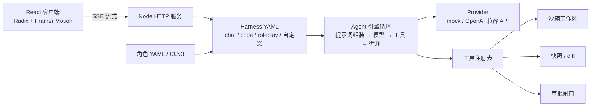
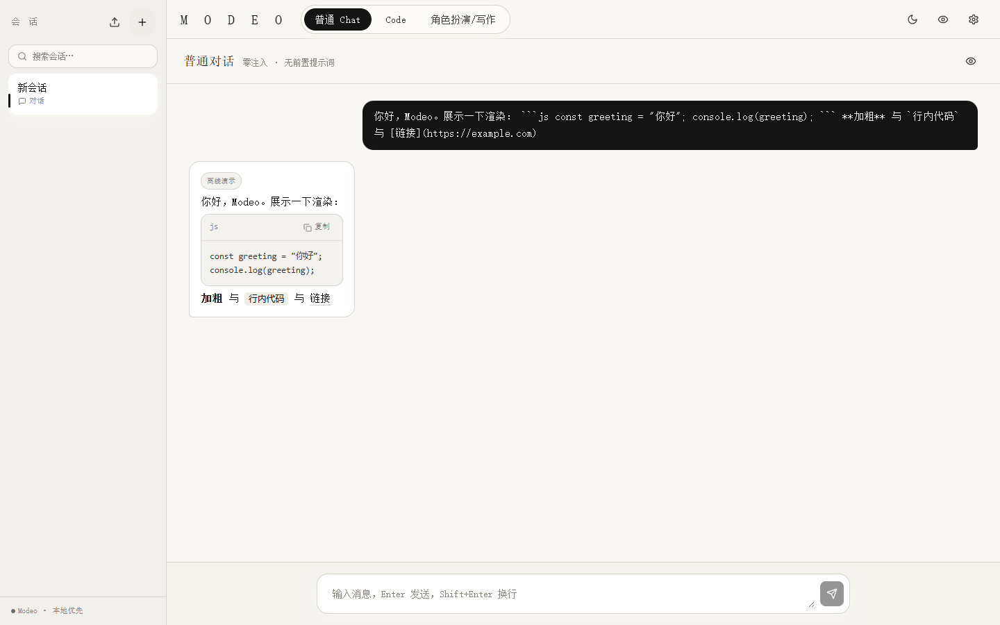
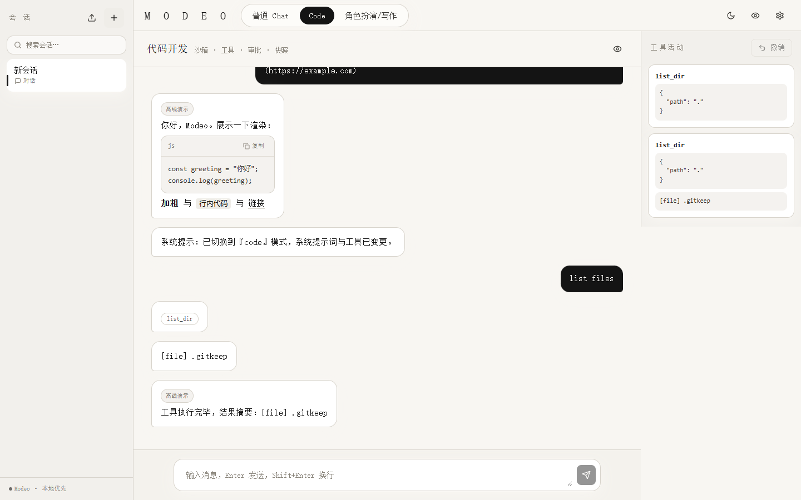

<div align="center">

# M O D E O

**三模式 AI Agent 桌面应用** — 纯净对话 · 代码开发 · 角色创作

本地优先 · 零 npm 依赖 · 模式即配置（Harness as YAML）


`/goal` `/压缩` `/clear` `/模式` `/new` `/help` — 斜杠命令原生支持

</div>

---

## 为什么存在

多数 Agent 产品要么只擅长一件事，要么功能堆叠但内部不透明。Modeo 验证一个假设：

> 用户需要的不是一个"什么都能干的 Agent"，而是一个能按场景切换工作方式、且每种方式自己都看得懂、改得动的 Agent。

模式切换在工程上 = harness 切换：提示词策略、工具集、上下文管理、UI 能力各不相同，但共享同一个核心运行时。

```diff
+ Core Engine ....... ONLINE   Node 内置模块，零 npm 依赖
+ Sandbox ........... READY    路径越界 / 符号链接逃逸拒绝
+ Approval Gate ..... ACTIVE   危险命令先审批，批准前绝不执行
+ Checkpoint ........ READY    变更前自动快照，一键撤销
+ Slash Commands .... 6 个     /goal /压缩 /clear /模式 /new /help
```

---

## 核心能力

### 三模式一键切换 —— 模式即配置

每种模式是一份可读、可编辑、可复制的 YAML harness（`configs/harness/*.yaml`），在设置里即可新建自定义模式，改动即时生效。

| 模式 | 定位 | 工具 |
|---|---|---|
| 普通 Chat | 零隐藏提示词的纯净对话 | 无 |
| Code | 沙箱工作区 + 文件读写 + shell + 自动测试 + 变更审查 | list_dir / read_file / write_file / edit_file / shell / run_tests / review_changes |
| 角色扮演/写作 | YAML 角色卡 + 世界状态 + 多角色阵容 | update_world_state |

### 透明是默认项

- 任何模式下都能打开"提示词透明面板"，查看实际发给模型的完整 system prompt、工具列表与消息结构（不含密钥）
- chat 模式 system prompt 恒为空：零注入
- 会话目标（`/goal`）以「【会话目标】」块注入提示词，同样透明可见

### Code：为写代码设计的 harness

- 沙箱工作区：所有文件操作锁定在 `workspaces/default`，`..` 越界与符号链接逃逸一律拒绝
- 审批闸门：`rm` / `format` / `shutdown` 等危险命令先弹审批，批准前不会真正执行；审批落盘，重启不丢
- 快照与撤销：写文件、编辑、跑 shell 前自动打快照，一键恢复
- 自动跑测试：`run_tests` 自动探测 `npm test` / `node --test` / `pytest` 入口
- 变更审查：`review_changes` 对比最近快照，输出行级 diff
- 识别 `AGENTS.md` 仓库约定，随系统提示词注入

### 角色：文件即角色

- 角色预设是规范化 YAML，支持表单 / 源码双视图编辑与 schema 校验
- CCv3（JSON / PNG tEXt）导入导出，可分享、可 diff、可入库
- 世界状态记忆：会话级事实键值对，模型持续更新，侧栏可编辑
- 多角色阵容：添加 / 移除 / 切换发言角色
- 角色包与市场：modeo-character-pack 分享格式，支持 URL 远程安装与任意静态索引市场

### 命令与效率

| 命令 | 作用 |
|---|---|
| `/goal <目标>` | 设置会话目标（注入提示词；留空清除） |
| `/压缩` | 调用模型把历史压缩为摘要 |
| `/clear` | 清空会话历史 |
| `/模式 <id>` | 切换模式（chat / code / roleplay） |
| `/new` | 新建会话 |
| `/help` | 查看全部命令 |

输入框以 `/` 开头即弹出补全列表（方向键 / Tab / Enter / Esc）。另有 Ctrl/⌘+K 命令面板、Ctrl+N 新建、Ctrl+E 导出、Ctrl+, 设置。

---

## 架构



- 引擎循环：组装系统提示词（harness + 角色 + AGENTS.md + 世界状态 + 目标）→ 流式调用模型 → 执行工具（审批 / 快照拦截）→ 结果回填 → 直到最终回答或达到 `maxIterations`
- 会话持久化：每次模型调用后落盘；审批挂起可断点续跑
- 零依赖承诺：主项目 `package.json` 无 dependencies，连 YAML 解析器都是内置自研

---

## 界面

| 模式 | 预览 |
|---|---|
| 普通 Chat |  |
| Code |  |
| 角色扮演 |  |

---

## 快速开始

需要 Node.js >= 20，无需 `npm install`。

```bash
cd modeo
node server.js        # 打开 http://localhost:8787
node --test           # 运行全部测试
```

Windows 可直接双击 `start.cmd`。桌面版（Electron 壳）：

```bash
cd desktop
npm install
npm start
```

默认使用内置 mock 模型（离线可玩）；在"设置"中填入 OpenAI 兼容 API 的 `baseUrl / apiKey / model` 即可接入真实模型。

---

## 项目结构

```text
configs/harness/   三模式 YAML 配置（chat / code / roleplay）
characters/        角色 YAML 文件与角色包
src/core/          harness、provider、session、approvals、YAML
src/tools/         沙箱、文件工具、shell、快照、diff、测试、插件加载
src/characters/    角色 schema / CCv3 / 角色包
src/runtime/       引擎循环与上下文压缩
frontend/          React 18 + Vite + Tailwind + Radix UI（构建产物输出到 web/）
desktop/           Electron 桌面壳
web/               前端构建产物（服务端优先托管）
tests/             node --test 单元测试
docs/              项目目标 / 技术规格 / 审查清单
```

---

## Roadmap

- 在线角色市场托管
- electron-builder 安装包生成
- UI 插件体系（工具插件已落地，UI 插件待续）

## 文档

- [项目目标](docs/PROJECT_GOALS.md)
- [技术规格](docs/SPEC.md)
- [审查清单](docs/CHECKLIST.md)

## License

MIT（`package.json` 已声明；`LICENSE` 文件与版权信息待补充）。

## 作者与联系方式

待补充（发布前请完善此节）。
